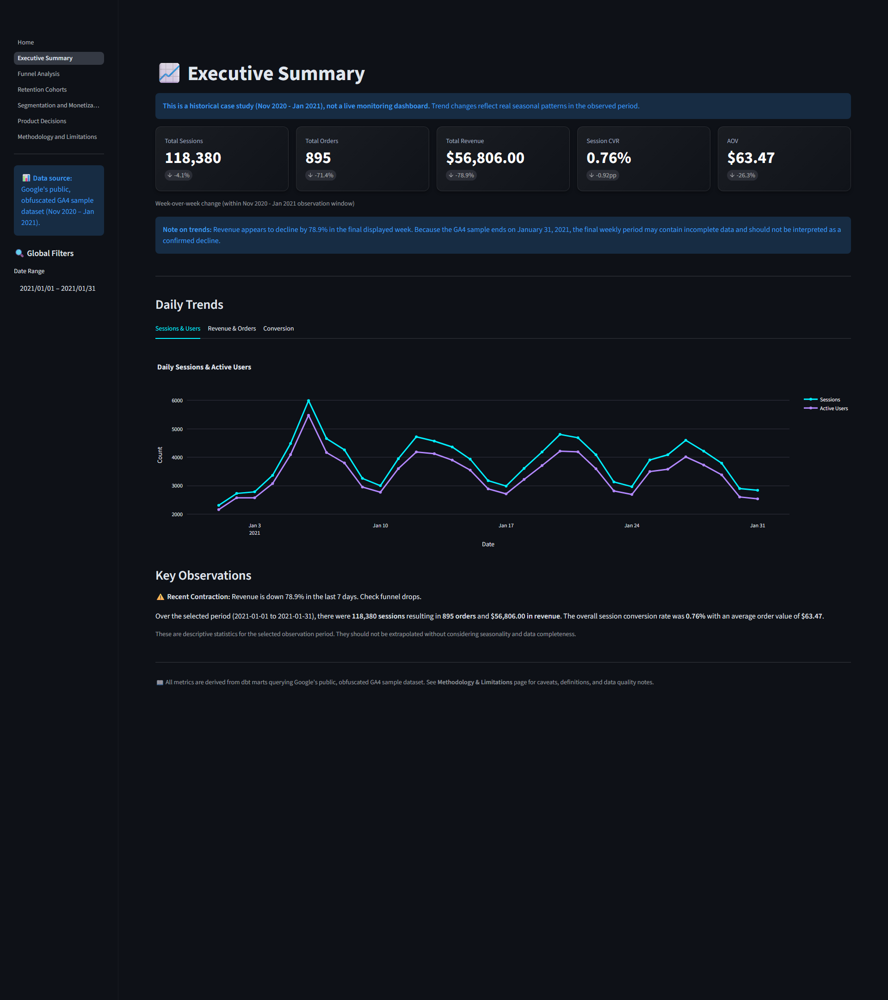
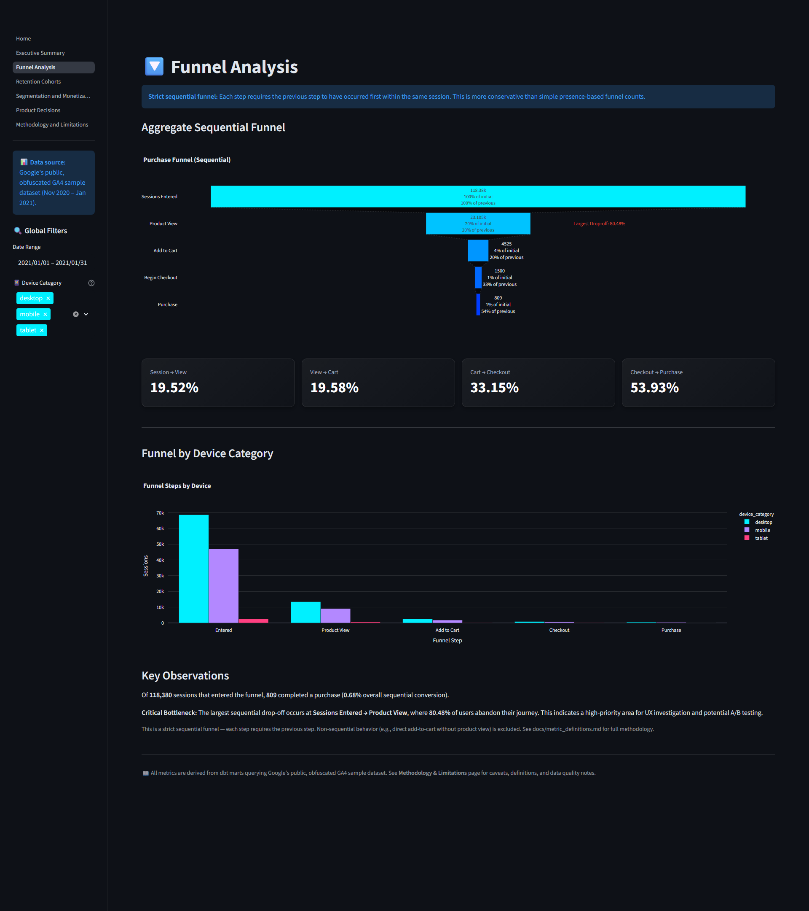
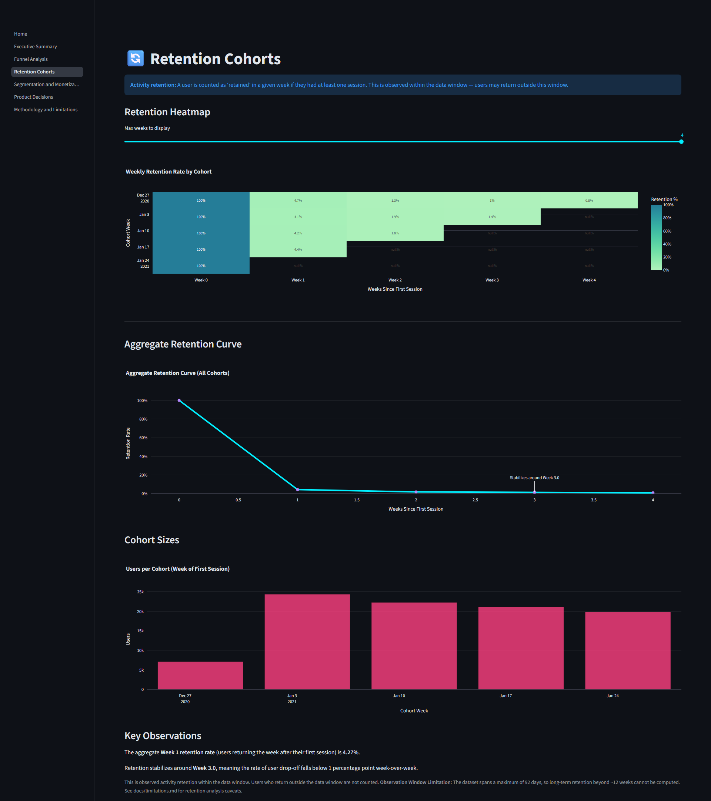
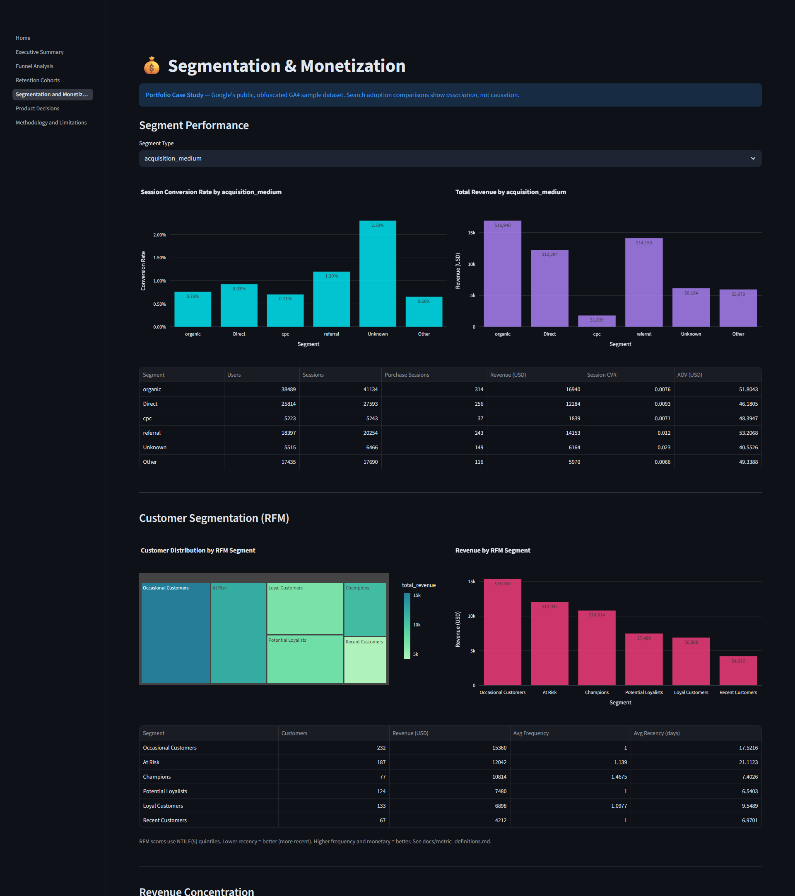
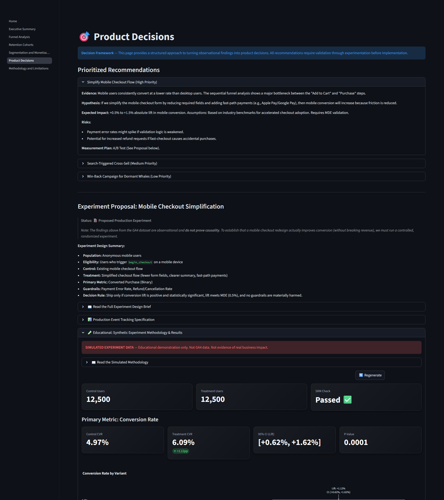
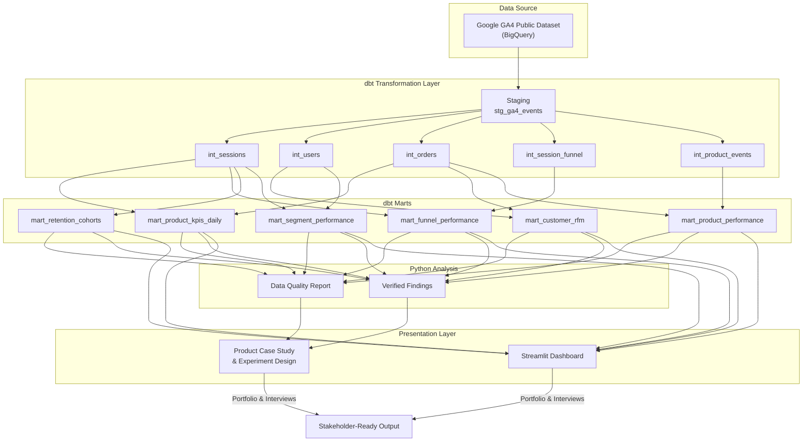
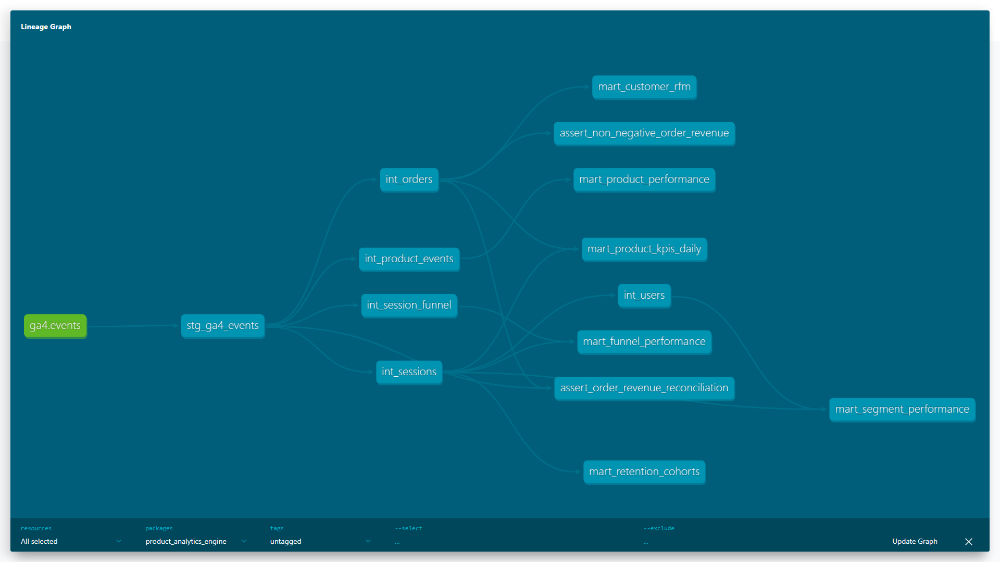

# Product Analytics Engine: Growth, Retention & Monetization

> A reproducible, batch product-analytics case study built on real, public GA4 ecommerce data from the Google Merchandise Store — demonstrating the full analytical lifecycle from raw event data to stakeholder-ready product decisions.

**Live Demo:** [Deployment link will be added after release]
*(The public demo reads pre-generated aggregate extracts for security, not live BigQuery).*

---

## Dashboard Screenshots







---

## Business Problem

As a Product Analyst supporting an ecommerce product, leadership wants evidence-based answers to prioritize product and engineering investments. The challenge is transforming raw, nested clickstream data into clear, actionable insights about where users drop off and what drives revenue.

---

## What This Project Answers

This analytics engine specifically answers:
- **Funnel drop-off:** Where do users abandon the purchase journey?
- **Retention:** Are users returning after their first activity?
- **Segmentation:** What behavioral or device segments create the most value?
- **Monetization:** Which channels and product combinations drive revenue?
- **Product recommendations:** What should the product/engineering team build or test next based on these findings?
- **Experiment design:** How would we measure the success of those recommendations rigorously?

---

## Dataset Disclosure

Google's public, obfuscated GA4 Google Merchandise Store sample ecommerce dataset.

This dataset covers a historical three-month period (Nov 2020 – Jan 2021). All user identifiers are anonymized by Google. While revenue values and event data represent actual production traffic, they may be sampled, obfuscated, or subject to tracking inconsistencies. No proprietary or confidential data is used, and the author has no affiliation with Google.

---

## Architecture



---

## dbt Lineage



---

## Data Model Overview

### Staging
- **`stg_ga4_events`** — One row per GA4 event. Flattens nested event parameters, device, geo, and traffic source fields.

### Intermediate
- **`int_sessions`** — One row per session. Aggregates events into session-level metrics and funnel flags.
- **`int_users`** — One row per anonymous user. Lifetime activity and acquisition attributes.
- **`int_orders`** — One row per deduplicated transaction. Revenue, device, and acquisition context.
- **`int_session_funnel`** — One row per session. Strict sequential funnel progression flags.
- **`int_product_events`** — One row per event-item combination. Unnested item-level detail.

### Marts
- **`mart_product_kpis_daily`** — Daily product KPIs: users, sessions, orders, revenue, conversion rate, AOV.
- **`mart_funnel_performance`** — Daily and device-level sequential funnel counts and step-to-step rates.
- **`mart_retention_cohorts`** — Weekly cohort retention: cohort size, retained users, retention rate.
- **`mart_customer_rfm`** — Purchaser-level RFM segmentation with labeled tiers.
- **`mart_segment_performance`** — Performance by device, channel, search adoption, purchaser status.
- **`mart_product_performance`** — Item-level purchase metrics: revenue, units, orders.

---

## Product Analytics Lifecycle

This project maps the ecommerce behavioral journey to the standard growth lifecycle:

```
Acquisition → Activation → Engagement → Monetization → Retention
```
*Session/First Visit → Product View → Add to Cart → Begin Checkout → Purchase → Repeat Purchase*

---

## Key Analytical Design Choices

1. **Event/session/order grains:** Each intermediate model enforces a single grain with unique key tests — session_key, user_pseudo_id, order_transaction_key.
2. **Strict sequential funnel:** Enforces `view_item → add_to_cart → begin_checkout → purchase` in temporal order within each session. More conservative than presence-based funnels but reveals true journey friction.
3. **Revenue deduplication:** `ROW_NUMBER()` over transaction key keeps only the earliest purchase event. Reconciliation test validates against source purchase revenue.
4. **Short-window observed retention:** Weekly activity retention bounded by the ~92-day data window. Not predictive — users who return after the window are not counted.
5. **RFM as descriptive segmentation:** `NTILE(5)` quintile scoring. Segment labels are categories, not predictions.

---

## Experimentation: What This Project Does and Does Not Prove

- **GA4 findings are observational.** The core dataset can identify drop-offs and correlations, but it cannot prove causal business impact.
- **Proposed production experiment is separate from real GA4 results.** The product recommendations are hypotheses that require a real A/B test to validate.
- **Synthetic simulation is clearly labeled and separate.** To demonstrate rigorous causal inference and statistical capability, this repository includes a separate deterministic simulation (`src/simulation/`).
- **No real business impact is claimed from the simulation.** It is strictly an educational demonstration of experiment design, statistical power analysis, and SRM checks.

---

## Data Quality and Tests

This project includes automated data quality checks at multiple layers:

1. **dbt tests** — Not-null, unique, accepted values, and custom SQL tests for non-negative revenue and order revenue reconciliation.
2. **Python quality report** — Row counts, null rates, event inventory, and duplicate transaction profiling.

---

## Local Setup Instructions

**Prerequisites:** Python 3.11+, Git, and a Google Cloud Platform account (free tier is sufficient).

### 1. Clone and Environment Setup

**Windows PowerShell:**
```powershell
git clone https://github.com/gaurav-619/Product-Analytics.git
cd Product-Analytics
python -m venv venv
.\venv\Scripts\Activate.ps1
```

**Mac / Linux:**
```bash
git clone https://github.com/gaurav-619/Product-Analytics.git
cd Product-Analytics
python3 -m venv venv
source venv/bin/activate
```

### 2. Install Dependencies

```bash
pip install -r requirements.txt
```

### 3. Configure Environment

```bash
cp .env.example .env
```
Edit `.env` with your GCP Project ID and desired date range (default: `20210101` to `20210131`).

### 4. Authenticate and Configure dbt

```bash
gcloud auth login
gcloud config set project your-gcp-project-id
gcloud auth application-default login
bq mk --location=US your-gcp-project-id:product_analytics_dev
```

Add this profile to your `~/.dbt/profiles.yml`:
```yaml
product_analytics_engine:
  target: dev
  outputs:
    dev:
      type: bigquery
      method: oauth
      project: your-gcp-project-id
      dataset: product_analytics_dev
      location: US
      threads: 4
```

### 5. Build Data Models

```bash
cd dbt_product_analytics
dbt deps
dbt build
cd ..
```

### 6. Generate Reports and Run Simulation

```bash
python -m src.data_quality.generate_quality_report
python -m src.analysis.generate_verified_findings
python -m src.simulation.generate_checkout_experiment
python -m src.simulation.analyze_checkout_experiment
```

### 7. Run the Application

The Streamlit dashboard can run in two modes:

**Mode A: Live BigQuery Development**
Reads directly from your BigQuery dataset (requires active credentials).
```bash
streamlit run app/Home.py
```

**Mode B: Public Deployment Mode (Static Extracts)**
Reads from local `.parquet` files for fast, credential-free deployment.
```bash
# Export your validated marts to static files first:
python src/export_deployment_data.py

# Then run Streamlit (it will automatically use local extracts if they exist)
streamlit run app/Home.py
```

See [Deployment Guide](docs/deployment.md) for full instructions on deploying to Streamlit Community Cloud.

---

## Reproduction and Validation Checklist

- [ ] `.env` configured with GCP Project ID
- [ ] `gcloud auth application-default login` completed
- [ ] `~/.dbt/profiles.yml` configured
- [ ] `dbt build` completes with all models created and tests passing
- [ ] Quality and findings scripts run successfully
- [ ] Simulation scripts run and `pytest tests/test_checkout_experiment.py` passes
- [ ] `streamlit run app/Home.py` launches the dashboard successfully

---

## Limitations

- **Anonymous users only** — `user_pseudo_id` is device-bound; no cross-device identity resolution.
- **Limited time window** — Metrics like retention are strictly bounded by the configured date range.
- **No qualitative context** — Findings lack user interviews, surveys, or session recordings to explain the "why."
- **Observational correlation** — Behavior (like site search adoption) correlates with conversion but is not proven to cause it.

---

## Skills Demonstrated

| Skill Area | Relevance to Product Analyst / Scientist |
|-----------|-----------------------------------------|
| **Product Sense** | Translating business ambiguity into an analytical framework (Acquisition → Retention) and actionable product decisions. |
| **SQL & Data Modeling** | Building robust, tested dbt pipelines on complex, nested JSON event schemas (GA4/Firebase style). |
| **Statistical Rigor** | Designing randomized controlled experiments, calculating sample size, testing for SRM, and evaluating guardrails. |
| **Dashboard Design** | Creating interactive, stakeholder-ready Streamlit applications focused on the "So what?" |
| **Engineering Quality** | Writing modular, version-controlled Python and SQL with automated data quality reconciliation tests. |

---

## Repository Structure

```
product-analytics-engine/
├── README.md
├── LICENSE
├── .gitignore
├── .env.example
├── requirements.txt
├── Makefile
├── .streamlit/config.toml
├── .github/workflows/ci.yml
├── app/
│   ├── Home.py
│   ├── utils.py
│   └── pages/
├── dbt_product_analytics/
│   ├── dbt_project.yml
│   ├── models/
│   │   ├── staging/
│   │   ├── intermediate/
│   │   └── marts/
│   └── tests/
├── src/
│   ├── analysis/
│   ├── data_quality/
│   └── simulation/
├── sql/
├── data/simulated/
├── assets/dashboard_screenshots/
├── docs/
└── tests/
```

---

## Interview Talking Points

1. **"Walk me through this project."** → See [`docs/interview_guide.md`](docs/interview_guide.md)
2. **"Why this dataset?"** → Real production data from a recognizable brand, publicly available, complex nested schema.
3. **"How do you handle data quality?"** → Multi-layer: dbt tests, Python quality scripts, dashboard empty-state handling.
4. **"What would you do differently with more data?"** → Cross-device identity, longer retention windows, actual A/B tests, qualitative research.
5. **"How does this apply to gaming?"** → See [`docs/gaming_translation.md`](docs/gaming_translation.md)

---

## License

MIT — See [LICENSE](LICENSE)
